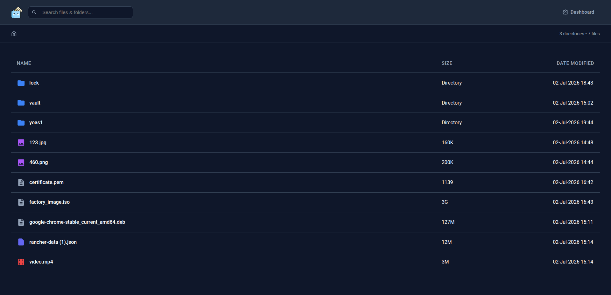
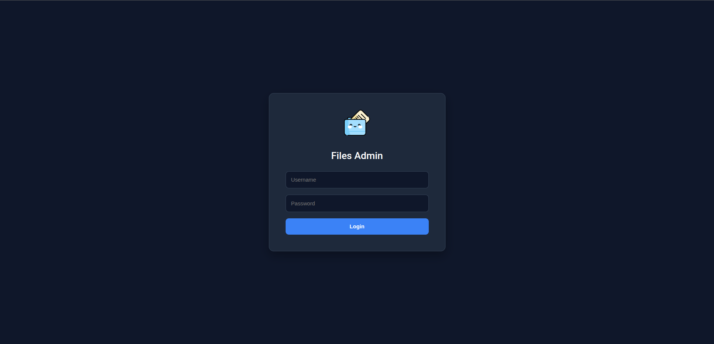
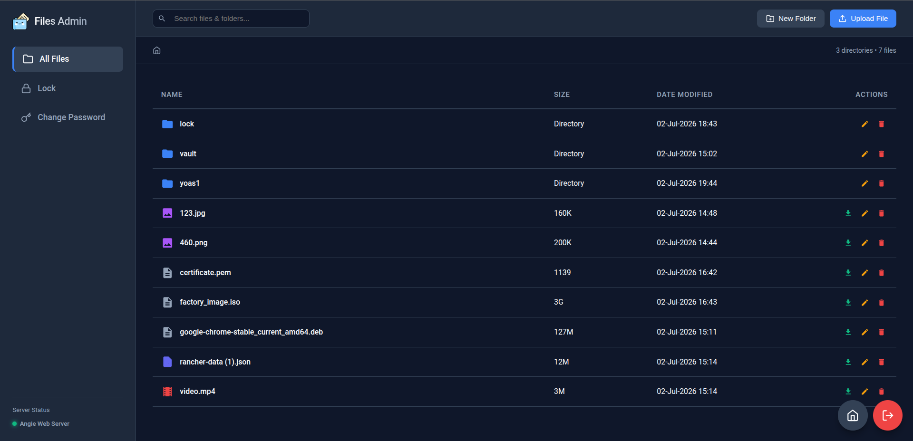

# Angie-Files

A file management interface powered by [Angie](https://github.com/webserver-llc/angie) (NGINX) WebDAV with an admin dashboard, public autoindex directory listing, and recursive search.


<p align="center">
  
</p>

## Overview

- **Admin Dashboard** — `/-/dashboard` — file management, upload, delete, rename, password change
- **Public Directory Listing** — Dark-themed autoindex page with search and admin-dashboard button.
- **Locked Directory** — Password-protected folder, configured via env var.
- **Password Change** — Built-in UI in the dashboard to change the user password.
- **Recursive Search** — Search through all directories up to depth 4, with full path display in results.

<p align="center">
  
  
</p>

## Prerequisites

- Docker
- Docker Compose (optional)

## Run with Docker

### Basic (user: admin, password: admin)

```bash
docker run -it --rm \
  -v ./data:/data \
  -p 8080:8080 \
  yoas1/angie-files:v1.0.1
```

### Custom locked directory and credentials

```bash
docker run -it --rm \
  -v ./data:/data \
  -p 8080:8080 \
  -e DIR=secret \
  -e USER=myuser \
  -e PASS=mypassword \
  yoas1/angie-files:v1.0.1
```

### Persist password across restarts (Volume)

To keep your credentials even after the container is removed and recreated:

```bash
# Create a volume for the password file
docker volume create angie-pass

# Run with the volume
docker run -it --rm \
  -v ./data:/data \
  -v angie-pass:/etc/angie/pass \
  -p 8080:8080 \
  -e USER=myuser \
  -e PASS=mypass \
  yoas1/angie-files:v1.0.1
```

Note: `USER` and `PASS` only take effect on the first container start. After that the file is persisted in the volume and won't be overwritten.

### Use an existing .htpasswd file

```bash
docker run -it --rm \
  -v ./data:/data \
  -v ./.htpasswd:/etc/angie/pass/.htpasswd \
  -p 8080:8080 \
  -e DIR=secret \
  yoas1/angie-files:v1.0.1
```

When mounting a custom `.htpasswd` file, the `USER` and `PASS` env vars are ignored.

## Run with Docker Compose
### Full example with password persistence

```yaml
services:
  angie-files:
    image: yoas1/angie-files:v1.0.1
    container_name: angie-files
    ports:
      - "8080:8080"
    volumes:
      - angie-data:/data
      - angie-pass:/etc/angie/pass
    environment:
      DIR: vault-folder
      USER: myuser
      PASS: mypassword

volumes:
  angie-data:
  angie-pass:
```

Start:

```bash
docker compose up -d
```

## Access

- **Dashboard:** `http://localhost:8080/-/dashboard`
- **Public listing:** `http://localhost:8080/`

## File Management via WebDAV (curl)

```bash
# Upload a file
curl -u admin:admin -T <myfile.txt> http://localhost:8080/upload/<target-dir>/

# Delete a file
curl -u admin:admin -X DELETE http://localhost:8080/upload/<target-dir>/<file>

# Delete a directory
curl -u admin:admin -X DELETE http://localhost:8080/upload/<target-dir>/<test>/
```

## Change Password

Via the dashboard sidebar: **Change Password**

Or directly via the API:

```bash
curl -u admin:admin -X POST \
  -H "Content-Type: application/json" \
  -d '{"new_password": "<new-password>"}' \
  http://localhost:8080/api/change-password
```

## Environment Variables

| Variable | Default | Description |
|----------|---------|-------------|
| `DIR` | `vault` | Locked directory name (password-protected) |
| `USER` | `admin` | Default username |
| `PASS` | `admin` | Default password |
| `TZ` | `Asia/Jerusalem` | Timezone |

## Tech Stack

- **Angie** (NGINX fork) — HTTP server + WebDAV
- **Python 3** — Password change service (`change-password.py`)
- **htpasswd** — User credential management
- **HTML/CSS/JS** — Frontend (zero external dependencies, air-gapped)

## License

 BSD 2-Clause
